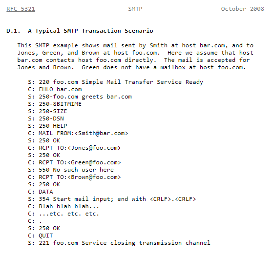

Email Pranks
============

Célestin Piccin & Kévin Jorand

------------

This repo contains an "e-mail prank generator", written in Java, as well as a mock stmp server running in a Docker container. To be precise, there are all the commands to build the docker image and to run the mock server in a container.

To use the prank generator, you should set up the following files. It then generates groups from the adresses, from which one is the (fake) sender and the other ones the recipients. It chooses a "prank message" from the list.

# File formats

## `config.txt`
The file should follow the syntax below. Its encoding must be UTF8, but line endings are unspecified.
```
localhost
25
7
```
Where `localhost` is the host to connect to (IPV4 address or `localhost`), `25` the port to use and `7` the number of groups to use.

## `addresses.txt`
The file should follow the syntax below. Its encoding must be UTF8, but line endings are unspecified. Each line should contain exactly 1 e-mail address.
```
recipient1@domain1.ch
recipient2@domain2.ch
recipient3@domain3.ch

[..]

recipientN@domainN.ch
```

## `messages.txt`
The file should follow the syntax below. Its encoding must be UTF8 but line endings are unspecified. Messages are separated by a line containing only a single `.`.
```
subject1 subject1 subject1
body1 body1 body1
body1 body1
body1
.
subject2 subject2 subject2
body2 body2 body2
body2 body2
body2
.

[...]

.
subjectN subjectN subjectN
bodyN bodyN bodyN
bodyN bodyN
bodyN
.
```

# Mock STMP Server

We used a version of Mockmock, which is a mock SMTP server to test and run our prank generator in order to avoid making requests against a "real one". Thus avoiding annoying the real owners of the e-mail adresses, but even more importantly, not generating a whole lot of SPAM and risking getting banned.

A mock SMTP server will act as one, to the sender but capture all the emails and not forward them to any other third-party server. 

# Using Mockmock
To run the Mockmock server in this repo in Docker, you should first have Docker installed. The we conveniently wrote 2 scripts ( [build.ps1](./mockmock/build.ps1) / [run.ps1](./mockmock/run.ps1) ). Those are written to be run on Windows, but since the Docker commands do not really change accross platforms, there shouldn't be much to do to get them working on another OS.

First, ensure Docker is running on your computer. Then laucnch the [build.ps1](./mockmock/build.ps1) script to build the image from the [Dockerfile](./mockmock/Dockerfile). As soon as it is fiished, you can lauch the [run.ps1](./mockmock/run.ps1) script to actually get the server up and running. That's it. 

The SMTP server then listens on port 25, the standard port. It then also operates on port 8282 which is the port being listened for the webinterface. The user can thus reach [localhost:8282](http://localhost:8282)  to have acces to the mock SMTP server's web user interface, seing all the emails that have been (falsely) sent through that SMTP server.

# Using the prank generator
*:warning: Ensure you do not send massive amount of unrequested emails!*

To use the prank generator, you should edit and place the correct setup in the files described above. You can then run a prank campaign simply by running the 
[runPrank.ps1](./application/DAI-SMTP/runPrank.ps1) script file. If you encounter any error, ensure you're running the lattest version of Java and jre on your computer and that your Docker container is running.

# Implementation details
Most of the usefull information can be found directly in the code documentation itself, however, we'll see a few global key points here.

An interesting point to note is that, while note ideal in an enterprise environment, in a school project, it is very interesting to see that the different classes have been implemented using different "ways", different "views"

## Client-Server Dialogue example
We can find directly in the [RFC5321](https://tools.ietf.org/html/rfc5321) an example of dialogue. In particular in the [appendix D1](https://tools.ietf.org/html/rfc5321#appendix-D) :




